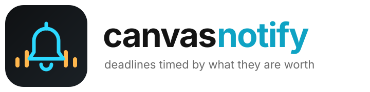

  <picture>
    <source media="(prefers-color-scheme: dark)" srcset="assets/logo-dark.svg">
    
  </picture>

  
  
  
  

  <a href="#quick-start">Quick Start</a> ·
  <a href="#how-the-lead-time-is-decided">Lead time</a> ·
  <a href="#privacy">Privacy</a> ·
  <a href="#pointing-it-at-another-school">Another school</a>

**Canvas deadlines, reminded on Telegram, timed by what each one is actually worth.**

A Chrome extension that polls Canvas for upcoming assignments and pushes reminders to Telegram, so
a due date never depends on remembering to open Canvas.

The point of it is the *timing*. A reminder that fires the same number of days ahead for every
assignment is useless, because a 5-point discussion post and a 300-point project need completely
different amounts of warning. So the lead time scales with the grade weight.

## How the lead time is decided

| Assignment is worth | First reminder |
| --- | --- |
| ≤ 10 points | 12 hours ahead |
| ≤ 50 points | 1 day |
| ≤ 150 points | 3 days |
| ≤ 300 points | 1 week |
| > 300 points | 2 weeks |

Then it adjusts for the kind of work:

| Type | Shift | Why |
| --- | --- | --- |
| Quiz | one step **earlier** | You can sit down and just finish it |
| Upload | one step **later** | It needs real work done first |

And for the time of day it lands:

- **Small assignments send at 9:30pm** — there is still time to knock one out tonight.
- **Big ones send at 10:00am** — you need a day, not an evening.

It picks up new course announcements too.

## Quick start

1. `chrome://extensions` → **Developer mode** → **Load unpacked** → this folder.
2. Open the popup → **Settings**, and fill in:

| Field | Where to get it |
| --- | --- |
| **Canvas token** | Canvas → Account → Settings → **New Access Token** |
| **Telegram bot token** | [@BotFather](https://t.me/BotFather) |
| **Chat ID** | Message your bot, then open `https://api.telegram.org/bot<TOKEN>/getUpdates` |

3. Hit **Send Test Message** to confirm, then **Save**.

It polls every 30 minutes.

## Privacy

Credentials live in `chrome.storage.local` on your own machine. They are sent to exactly two
places — Canvas and Telegram — and nowhere else. There is no server in the middle and no account
to create.

## Pointing it at another school

The Canvas host is hardcoded to `utampa.instructure.com`. Change it in two places:

- the two `fetch` URLs in `background.js`
- the matching `host_permissions` entry in `manifest.json`

## License

MIT — see [LICENSE](LICENSE).
